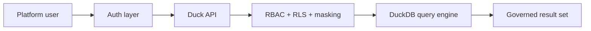

# Quickstart

This path is the fastest way for a platform user to understand how access works and what "first value" looks like in Duck.

## Prerequisites

- a Duck deployment URL
- a user account, bearer token, or API key provided by your organization
- an approved access path such as browser, SQL client, API, or CLI

## 1. Confirm how you access the platform

Most users enter Duck through one of these paths:

- browser-based product surfaces
- SQL-compatible clients
- API-backed tools or scripts
- CLI workflows for advanced users

## 2. Choose an authentication path

Common user paths are:

- browser sign-in backed by your identity provider
- bearer tokens in `Authorization: Bearer <token>`
- API keys in `X-API-Key: <key>` for approved automation use cases

For a deeper overview, go to [Access the Platform](/how-to/authentication).

## 3. Run your first secure query

```bash
curl -X POST "https://your-duck-host/v1/query" \
  -H "Content-Type: application/json" \
  -H "Authorization: Bearer <token>" \
  -d '{"sql":"SELECT pickup_date, trip_count, gross_revenue FROM sample_data.nyc_taxi.daily_metrics ORDER BY pickup_date LIMIT 5"}'
```

Expected result:

```json
{"columns":["pickup_date","trip_count","gross_revenue"],"rows":[["2024-01-01",8000,219862.25],["2024-01-02",8000,277281.32]]}
```

The exact JSON shape may include metadata fields, but you should see rows coming back from the built-in `sample_data` catalog with no extra setup.

## 4. Explore the platform

Once the first query succeeds, your next user actions are usually:

- browse available catalogs and schemas
- inspect table and view structure
- discover what objects you are allowed to query
- confirm whether any masking or row filtering applies to your role
- when you are ready for a writable environment, use `duck init` to bootstrap a medallion catalog

## Request flow at a glance



## Troubleshooting

### `curl` cannot connect

- verify the deployment URL with your admin
- confirm you are on the correct network path or VPN

### Query returns auth errors

- verify whether your team expects browser sign-in, bearer tokens, or API keys
- confirm the credential is still valid
- see [Access the Platform](/how-to/authentication) for auth-path details

### Query returns `403 Forbidden`

Authentication worked, but your current principal does not have the required grants or policy-compatible access.

## Next Steps

- [Ways to Access Duck](/start-here/deployment-modes)
- [Query and Explore Data](/how-to/use-the-cli)
- [Manage Access](/how-to/access-control)

## Related Reference

- [Glossary](/reference/glossary)
- [Advanced API Reference](/reference/api)
